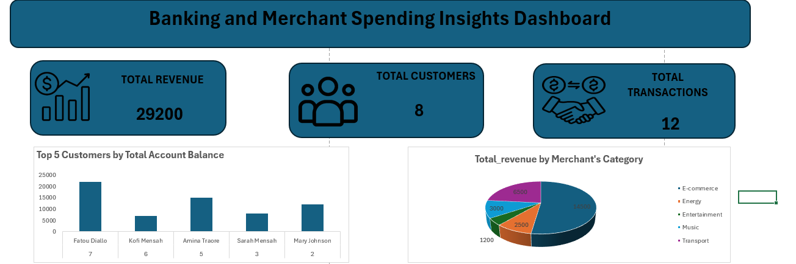

# 💼 Banking & Merchant Spending Analytics Project

## 📊 Project Overview
This project analyzes banking transactions, customer behavior, and merchant performance using SQL and Excel. The goal is to convert raw transactional data into meaningful business insights.

---

## 🗂️ Dataset Structure
- Customers  
- Accounts  
- Transactions  
- Merchants  
- Merchant Transactions  

---

## 🛠️ Tools Used
- SQL (Data analysis & queries)
- Excel (Dashboard & visualization)

---

## 📊 Key KPIs
- Total Revenue  
- Total Customers  
- Total Transactions  

---

## 📈 Dashboard Preview

---

## 🔍 Key Insights
- Ghana has the highest number of customers  
- Amazon is the top-performing merchant  
- E-commerce is the leading revenue category  
- May 2025 recorded the highest transaction value  
- Mary Johnson is the most active customer  

---

## 🧠 SQL Skills Used
- JOINs  
- GROUP BY  
- Aggregations (SUM, COUNT)  
- Subqueries  
- Date functions  

---

## 🚀 Author
Built by Suliat
